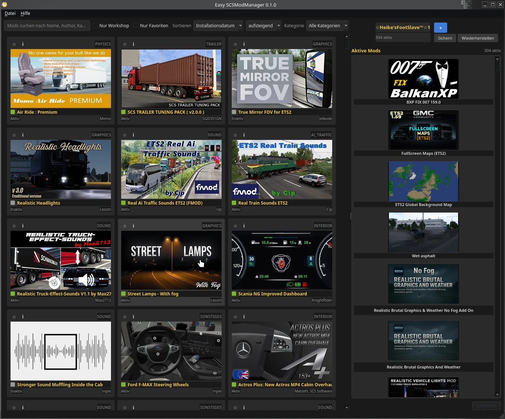

<p align="center">
  <picture>
    <source media="(prefers-color-scheme: dark)" srcset="easy_scsmodmanager/resources/images/readme_header_dark.webp">
    <source media="(prefers-color-scheme: light)" srcset="easy_scsmodmanager/resources/images/readme_header_light.webp">
    
  </picture>
</p>

<h1 align="center">🚚 Easy SCSModManager</h1>

[](https://www.python.org/)
[](https://www.python.org/)
[](https://www.scssoft.com/)
[](https://github.com/Switch-Bros/easy-scsmodmanager/blob/main/LICENSE)
[](https://github.com/Switch-Bros/easy-scsmodmanager)
[](https://github.com/Switch-Bros/easy-scsmodmanager)

> **Ein richtiger Mod-Manager für Euro Truck Simulator 2 und American Truck Simulator.**
> Mods durchstöbern, die aktive Ladereihenfolge per echtem Drag and Drop sortieren und direkt ins Profil zurückschreiben - mit automatischen Backups.

<p align="center">
  <a href="README.md">
    
  </a>
</p>

<!-- Hero-Screenshot -->
<p align="center">
  
</p>


<h3 align="center">💛 Projekt unterstützen</h3>

Wenn dir dieser Manager Zeit beim Sortieren deiner Mod-Liste spart, kannst du die Entwicklung unterstützen. Jeder Beitrag - egal wie klein - hält das Projekt am Leben.

<p align="center">
  <a href="https://www.paypal.com/donate/?hosted_button_id=HWPG6YAGXAWJJ">
    
  </a>
  &nbsp;&nbsp;&nbsp;&nbsp;&nbsp;
  <a href="https://ko-fi.com/S6S51T9G3Y">
    
  </a>
</p>

<p align="center"><i>Danke an alle, die schon beigetragen haben - ihr seid großartig! 🙏</i></p>

<p align="center">
  <picture>
    <source media="(prefers-color-scheme: dark)" srcset="easy_scsmodmanager/resources/images/readme_divider_dark.webp">
    <source media="(prefers-color-scheme: light)" srcset="easy_scsmodmanager/resources/images/readme_divider_light.webp">
    
  </picture>
</p>


<h2 align="center">✨ Was die App kann</h2>

- **Findet jeden deiner Mods** - liest deinen lokalen `mod/`-Ordner und deine Steam-Workshop-Abos für ETS2 und ATS, unter Linux und Windows
- **Browser im ETS2-Stil** - Karten-Raster mit Vorschaubildern, Suche, Sortierung und Mehrfachauswahl (Strg / Shift)
- **Echtes Drag and Drop** - Mods zwischen Bibliothek und aktiver Liste ziehen, die Ladereihenfolge per Ziehen umsortieren, mit sanftem Scrollen und klarer Einfügemarkierung
- **Schreibt deine Reihenfolge zurück** - speichert die aktive Mod-Liste direkt in deine `profile.sii`, damit das Spiel genau mit deiner Reihenfolge startet
- **Automatische Backups** - vor jedem Speichern kann ein Backup angelegt werden, und du stellst jedes frühere Profil mit einem Klick wieder her
- **Profil-Verwaltung** - wechsle zwischen deinen Profilen und sieh, welche Mods jedes nutzt
- **Beide Spiele, eine App** - ETS2 und ATS von Anfang an, mit Spiel-Umschalter in der Oberfläche


<h2 align="center">🛣️ Geplant</h2>

- Konflikt-Erkennung über def-Datei-Überschneidungen
- Mod-Presets / teilbare Ladereihenfolge-Profile
- Workshop-Update-Benachrichtigungen und Ein-Klick-Links zur Workshop-Seite


<h2 align="center">🚀 Loslegen</h2>

```bash
git clone https://github.com/Switch-Bros/easy-scsmodmanager.git
cd easy-scsmodmanager
pip install -e .
python -m easy_scsmodmanager
```

Benötigt Python 3.12+ und PyQt6. Eigenständige Linux-AppImage- und Windows-Builds sind geplant.


<h2 align="center">📜 Lizenz</h2>

[GPL-3.0-or-later](LICENSE) - Copyright © 2026 Switch Bros.

<p align="center">
  <picture>
    <source media="(prefers-color-scheme: dark)" srcset="easy_scsmodmanager/resources/images/readme_footer_dark.webp">
    <source media="(prefers-color-scheme: light)" srcset="easy_scsmodmanager/resources/images/readme_footer_light.webp">
    
  </picture>
</p>

<p align="center">
  Mit ❤️ unter Linux gebaut von <a href="https://github.com/Switch-Bros">Switch Bros</a>
</p>
